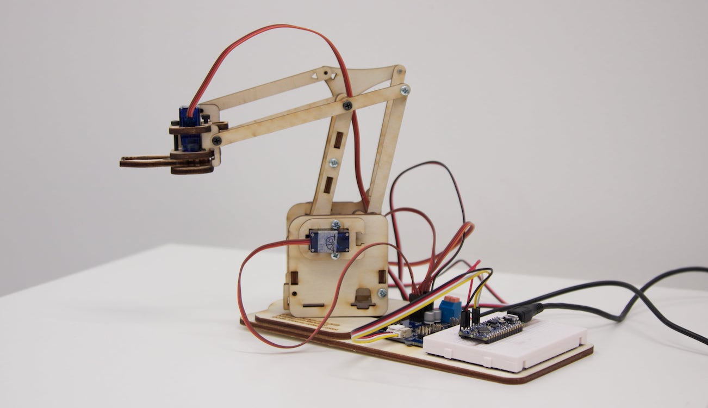

# DE-Arm
Resources for the DE-Arm, the Wekinator and Arduino controlled laser-cut robot arm based off the MeArm project. Created for the IDE and GID programmes in the Dyson School of Design Engineering at Imperial College London.

## Summary
The DE-Arm is an open source project that consists of a robot arm with 4 degrees-of-motion each controlled by a single servo motor. The arm itself is cut from 4mm laser cut plywood and is assembled with M3 screws of varying lengths.

The four servo motors are controlled by a circuit board which handles all power and communication. It is controlled by an Arduino over I2C communication.

The Arduino board can be controlled by receiving OSC messages sent from Wekinator, an interactive machine learning software tool, though this is not required.

# Directory of Resources
The following files can be found in this repository.

| Folder | Filename | Description |
| ----------- | - |----------- |
| physical-build-resources | DE-Arm-BOM.xslx | Spreadsheet lising all materials needed to build one robot arm
|  | DE-Arm2022.ai | Adobe Illustrator file for laser cutting the arm
|  | DE-Arm2022.dxf | DXF export of Illustrator file for laser cutter

# Building the Arm

# Development History

The DE-Arm is based off of the open source MeArm V3 from [MeArm Robotics Lab](https://mearm.com/).

The original build instructions for the MeArm can be found on the [company website](http://learn.mearm.com/docs/building-the-mearm-v3/) and [Instructables](https://www.instructables.com/MeArm-Build-a-Small-Hackable-Robot-Arm/). The original laser cutting file that was modified to create the DE-Arm is available on [Thingiverse](https://www.thingiverse.com/thing:3420797).