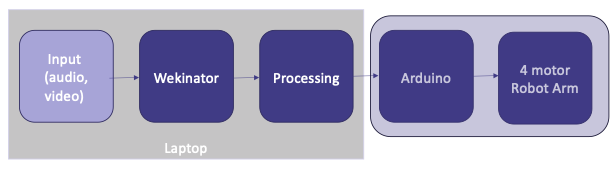

# DE-Arm
Resources for the DE-Arm, the Wekinator and Arduino controlled laser-cut robot arm based off the MeArm project. Created for the IDE and GID programmes in the Dyson School of Design Engineering at Imperial College London.

## Summary
The DE-Arm is an open source project that consists of a robot arm with 4 degrees-of-motion each controlled by a single servo motor. The arm itself is cut from 4mm laser cut plywood with a 2mm base and is assembled with M3 screws of varying lengths.

The four servo motors are controlled by an Arduino board.

The Arduino board can be controlled by receiving OSC messages sent from Wekinator, an interactive machine learning software tool, via Processing though this is not required. The Arduino could be used on its own.

# Directory of Resources
The following files can be found in this repository.

| Folder | Filename | Description |
| ----------- | - |----------- |
| osc-routing |  arduino-osc-blink | Arduino sketch which changes LED blinking pattern based on incoming message; to be run with the processing-osc-to-arduino Processing sketch |
|  | processing-osc-to-arduino | Processing sketch which listens for OSC messages from Wekinator and converts them to serial messages for Arduino; to be run with the arduino-osc-blink Arduino sketch
| physical-build-resources | DE-Arm-Assembly.pdf | PDF with illustrated build instructions; directly modified from the MeArm build instructions |
| | DE-Arm-BOM.xslx | Spreadsheet listing all materials needed to build one robot arm
|  | DE-Arm2024_individual.ai | Adobe Illustrator file for laser cutting the arm
|  | DE-Arm2024_individual.dxf | DXF export of Illustrator file for laser cutter
|  | DE-Arm_base_plate.ai | Illustrator file technical drawing for customisable base plate
| wekinator-input | video_input_100_pixels | Simple Processing sketch which will sample 100 pixels across the camera input and send only those on in OSC messages.

# Development History

The DE-Arm is based off of the open source MeArm V3 from [MeArm Robotics Lab](https://mearm.com/).

The original build instructions for the MeArm can be found on the [company website](http://learn.mearm.com/docs/building-the-mearm-v3/) and [Instructables](https://www.instructables.com/MeArm-Build-a-Small-Hackable-Robot-Arm/). The original laser cutting file that was modified to create the DE-Arm is available on [Thingiverse](https://www.thingiverse.com/thing:3420797).

This module is taught at the [Dyson School of Design Engineering](https://www.imperial.ac.uk/design-engineering/) at [Imperial College London](https://www.imperial.ac.uk/).